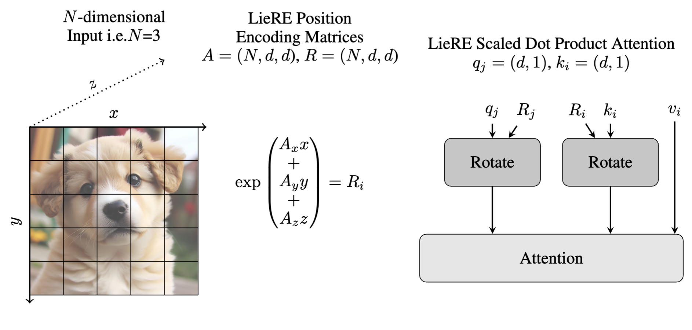

# 🔄 LieRE: Generalizing Rotary Position Encodings

[](https://arxiv.org/abs/2406.10322)
[](https://opensource.org/licenses/MIT)

## 🔍 Overview

While Rotary Position Embeddings (RoPE) have become widely adopted for large language models, their application across other modalities has been limited. This repository introduces **Lie group Relative position Encodings (LieRE)**, which extends beyond RoPE to support n-dimensional inputs.

<p align="center">
  
</p>

## 📈 Performance Highlights

LieRE demonstrates significant improvements compared to baselines (DeiT III, RoPE-Mixed, and Vision-Llama):

- **🎯 Accuracy**: Up to 9.7% increase for 2D tasks and 25.5% for 3D tasks compared to DeiT III (absolute position encoding)
- **⚡ Training Efficiency**: 3.5x reduction in training time compared to DeiT III (absolute position encoding)
- **📊 Data Efficiency**: 30% improvement in data utilization compared to DeiT III (absolute position encoding)

## 💻 Implementation Details

LieRE represents rotation matrices as the matrix exponential of skew-symmetric matrices, making them learnable by parametrizing the rotations with generators before applying the matrix exponential.

```python
# Core Implementation
generator_raw_params = nn.Parameter(
    torch.rand(
        input_dimensionality,
        head_dim,
        head_dim,
    ) * 2 * math.pi
)
upper_triangle = (
    torch.triu(generator_raw_params, diagonal=1)
)
skew_bases = upper_triangle - torch.transpose(upper_triangle, -1, -2)
in_basis_positions = (
    positions.reshape(list(positions.shape) + [1] * 2) * skew_bases
)
generator_pos = torch.sum(in_basis_positions, dim=-3)
rotation = torch.matrix_exp(generator_pos.to(dtype=torch.float32)).to(dtype=positions.dtype)
```

## 🚀 Getting Started

### 📦 Dependencies

- PyTorch >= 1.7.0
- PyTorch Lightning
- torchvision

### 🔧 Installation

```bash
git clone https://github.com/yourusername/liere-position-encodings.git
cd liere-position-encodings
pip install -r requirements.txt
```

### 🏃‍♂️ Usage

To reproduce the CIFAR-100 results, use:

```bash
sbatch -c 48 --gres=gpu:l40:4 --nodelist=rae1 --time=00:00:00 lightning_cifar100.sh
```

You can compare different position encoding methods using the following options:
- `liere`: Our proposed method
- `rope_mixed`: RoPE-Mixed baseline
- `absolute`: Standard absolute position encoding
- `visionllama`: Vision-Llama encoding

## 🧩 Base Repository

This implementation builds upon the transformer implementation and hyperparameters from [vision-transformers-cifar10](https://github.com/kentaroy47/vision-transformers-cifar10).

## 📝 Citation

If you find this work useful, please cite:

```bibtex
@article{ostmeier2024liere,
  title={LieRE: Generalizing Rotary Position Encodings},
  author={Ostmeier, Sophie and Axelrod, Brian and Moseley, Michael E and Chaudhari, Akshay and Langlotz, Curtis},
  journal={arXiv preprint arXiv:2406.10322},
  year={2024}
}
```

## ⚖️ License

This project is licensed under the MIT License - see the [LICENSE](LICENSE) file for details.

## 🙏 Acknowledgments

- Much of the code was branched from [vision-transformers-cifar10](https://github.com/kentaroy47/vision-transformers-cifar10)
- Thanks to all contributors and supporters of this research
